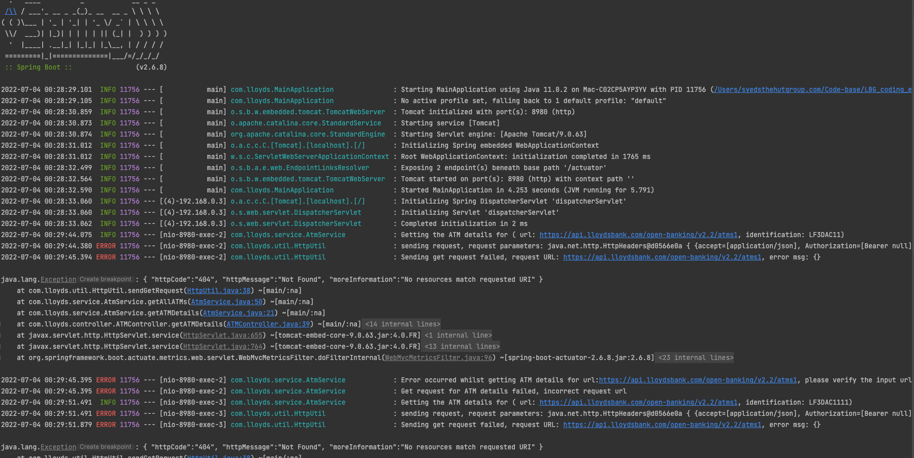
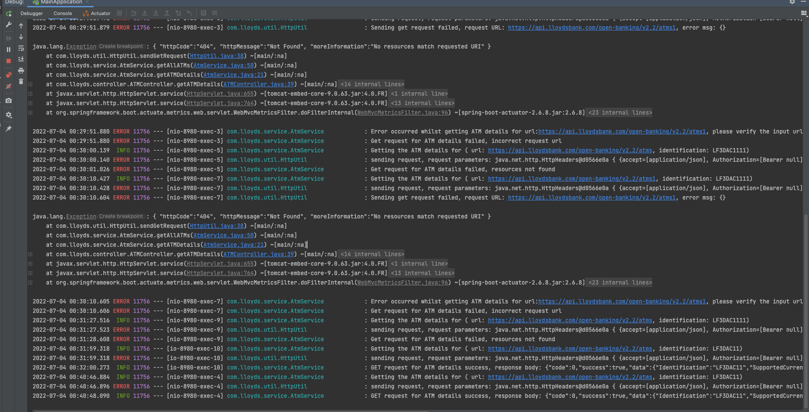

# ATM information query service

The service provides the GET endpoint to access the ATM details for the Llyods bank using the open-api.

1. Create a java spring-boot microservice using gradle exposing one GET method requiring two values: This should return the identification value as well as full details of ATMs from the opendata-v2.2#get-atms-2.2 api.
 The below are the API requests and responses.
``` 
   Request Params:
        
         "url": "https://api.lloydsbank.com/open-banking/v2.2/atms",
         "identification":"30847300"
        
    Bad Request:
    http://localhost:8980/api/v1/atmdetails?url=https://api.lloydsbank.com/open-banking/v2.2/atms1&identification=LF3DAC11

    400 Bad Response:
    {
    "timestamp": "2022-07-03T23:30:10.609+00:00",
    "status": 400,
    "error": "Bad Request",
    "path": "/api/v1/atmdetails"
    }
    
    Bad Request:
    http://localhost:8980/api/v1/atmdetails?url=https://api.lloydsbank.com/open-banking/v2.2/atms&identification=LF3DAC1111
    
    404 Bad Response:
    {
    "timestamp": "2022-07-03T23:31:28.625+00:00",
    "status": 404,
    "error": "Not Found",
    "path": "/api/v1/atmdetails"
    }
    
    Valid Request:
    http://localhost:8980/api/v1/atmdetails?url=https://api.lloydsbank.com/open-banking/v2.2/atms&identification=LF3DAC11
    
    200 OK Response:
    {
    "code": 0,
    "success": true,
    "data": {
    "supportedCurrencies": [
    "GBP"
    ],
    "identification": "LF3DAC11",
    "location": {
    "postalAddress": {
    "country": "GB",
    "addressLine": [
    "42-46 MARKET STREET;"
    ],
    "streetName": "42-46 MARKET STREET",
    "townName": "MANCHESTER",
    "countrySubDivision": [
    "LANCASHIRE"
    ],
    "postCode": "M1 1PW"
    }
    }
    }
    }
        
``` 
       

2. Create logging and demonstrate it by logging to the console.




3. Provide OpenAPI swagger specs functionality for your api.
    OpenAPI swagger specs functionality can be found here : http://localhost:8980/swagger-ui/index.html?configUrl=/v3/api-docs/swagger-config#/

4. Activate the actuator endpoint.
    * http://localhost:8980/actuator/
    * http://localhost:8980/actuator/health
    * http://localhost:8980/actuator/metrics/

5. Create a jar file which can be used to run as a docker image.
    run this command```./gradlew build```, then th jar file can be found at `/build/libs` folder.
